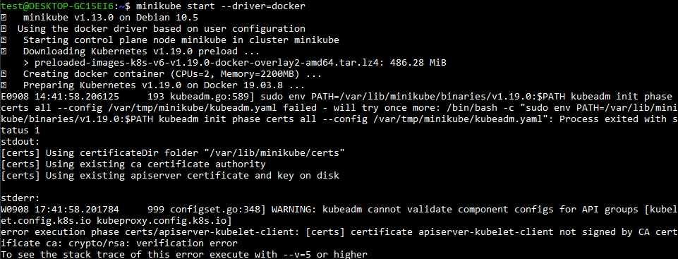
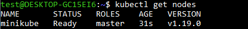
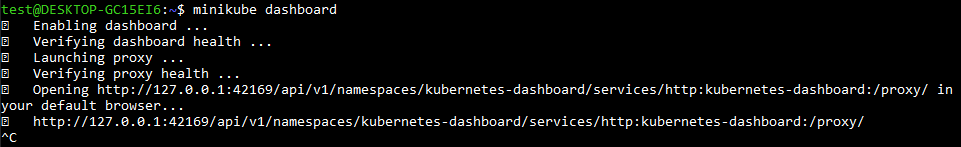
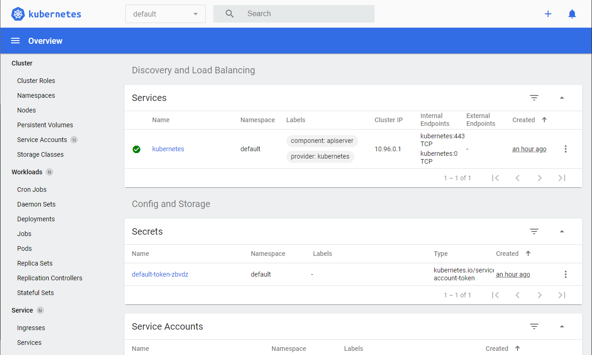

<p align="center">
  <a href="https://www.instagram.com/devfullcycle/" target="blank"></a>
</p>

# Guia rápido de instalação do Kubernetes com Docker no WSL 2

## Instale/configure o WSL 2 com Docker corretamente

Veja este tutorial: [https://github.com/codeedu/wsl2-docker-quickstart.git](https://github.com/codeedu/wsl2-docker-quickstart.git).

### Atualize as informações dos pacotes:

Execute o comando:
```sh
sudo apt update
```

### Instale o cURL e Git:

Execute o comando:
```sh
sudo apt install curl git
```

### Habilite o SystemD no Linux:

Execute o comando:
```sh
sudo apt install -yqq daemonize dbus-user-session fontconfig
```

Hablite o SystemD seguindo o tutorial: [https://github.com/codeedu/wsl2-systemd-script](https://github.com/codeedu/wsl2-systemd-script). É muito importante que o scripts **start-systemd-namespace** esteja especificado no arquivo .bashrc ou .zshrc (zsh/oh-my-zsh).

### Instale o Minikube

Execute os comandos:
```sh
# Download the latest version of Minikube
curl -Lo minikube https://storage.googleapis.com/minikube/releases/latest/minikube-linux-amd64
# Make the binary executable
chmod +x ./minikube
# Move the binary to your executable path
sudo mv ./minikube /usr/local/bin/
```

## Inicialize o Minikube

Execute o comando:
```sh
minikube start --driver=docker
```

Acontecerá um erro na inicialização.



Exclua o nó minikube com o comando:
```sh
minikube delete
```
Inicialize o Minikube novamente:
```sh
minikube start --driver=docker
```

O minikube permite trabalhar com os seguintes drivers:

* Docker - container-based
* KVM2 - VM-based
* VirtualBox - VM
* None - bare-metal
* Podman - container (experimental)

Neste exemplo usamos Docker, pois sua configuração é simples e o desempenho é satisfatório.

## Verificando funcionamento do Minikube

### Verifique se o nó minikube foi criado

Execute o comando:
```sh
kubectl get nodes
```


### Rode o Kubernetes Dashboard

Execute o comando:

```sh
minikube dashboard
```
Acesse o endereço que será mostrado no log do terminal.




## Dicas

* Quando não estiver usando minikube/kubernetes execute ```minikube stop``` para parar o processo do Minikube. Isto economizará processamento e memória.
* Das próximas vezes que necessitar iniciar o Minikube execute ```minikube start```.
